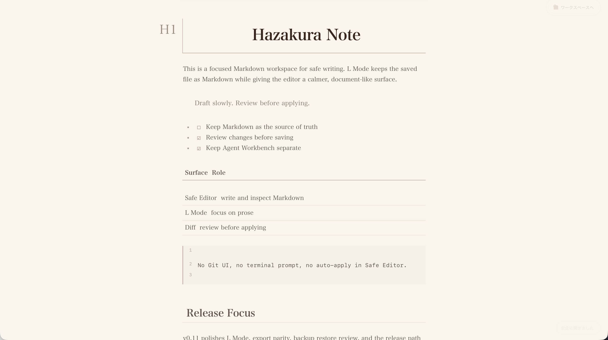
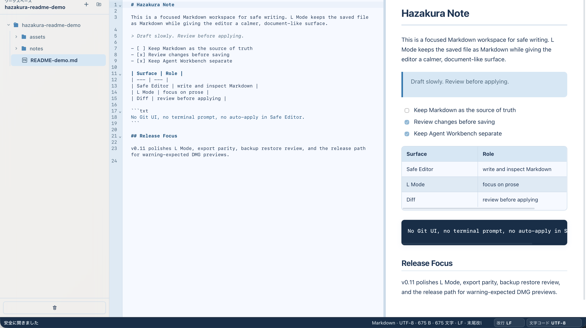
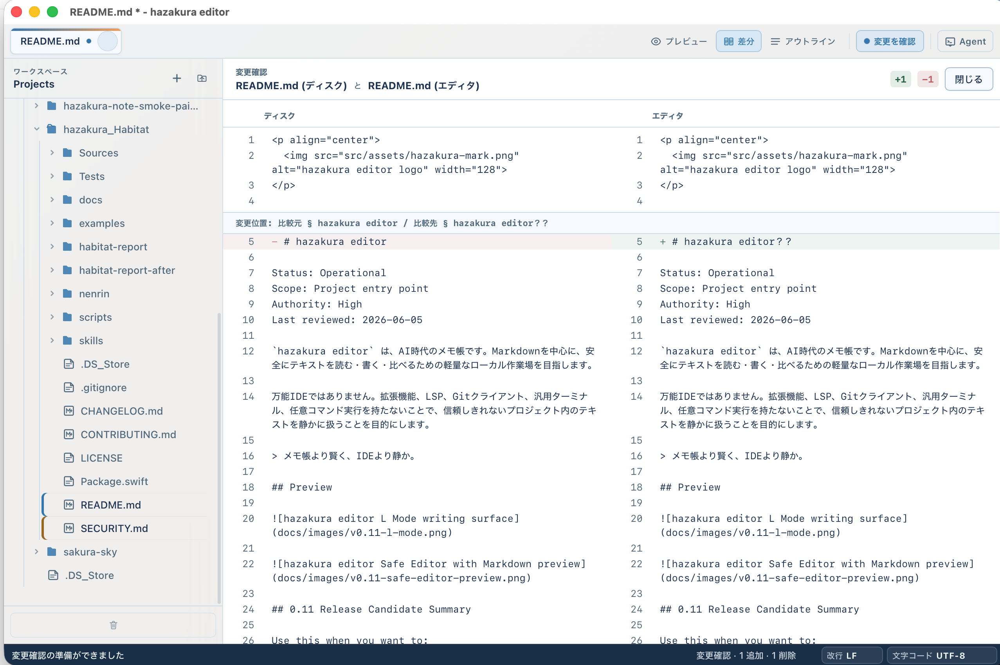

<p align="center">
  
</p>

# hazakura editor

Status: Operational
Scope: Project entry point
Authority: High
Last reviewed: 2026-06-05

`hazakura editor` は、AI時代のメモ帳です。Markdownを中心に、安全にテキストを読む・書く・比べるための軽量なローカル作業場を目指します。

万能IDEではありません。拡張機能、LSP、Gitクライアント、汎用ターミナル、任意コマンド実行を持たないことで、信頼しきれないプロジェクト内のテキストを静かに扱うことを目的にします。

> メモ帳より賢く、IDEより静か。

## Preview







## 0.11 Preview Summary

Use this when you want to:

- open a selected project folder without running it
- read and edit Markdown or text files
- preview sanitized Markdown with local image asset rendering
- preserve LF / CRLF and final-newline behavior
- compare text files and review local changes without Git awareness
- review pasted candidate text in Review Desk, compare it against the active buffer, and explicitly apply it without auto-saving
- notice save conflicts and external changes before overwriting
- paste or drag-drop images into `assets/` for inline Markdown references
- export content as standalone HTML or use Print to PDF
- use a command palette for existing safe app actions
- run bounded workspace text search without background indexing
- pin frequently opened files on the start panel
- use えるモード / L Mode as a WYSIWYG-tier one-pane writing surface with magazine-feel typography, where Markdown source remains the truth
- review and explicitly apply auto-backup snapshots to the active document buffer without auto-saving
- create new workspace files and folders, rename workspace entries, and move entries to Trash from bounded in-app file-tree actions
- optional detached Agent Window with `codex` / `opencode` / `pi` / `claude` provider sessions

Do not use this as:

- an IDE
- a terminal
- a Git client
- a trusted or notarized macOS distribution
- a safe wrapper around arbitrary AI or CLI behavior

Example use case:

1. Open a project folder you do not want to execute.
2. Read README, docs, or notes through the file tree.
3. Edit a Markdown or text file, with optional image paste / drag-drop.
4. Preview sanitized Markdown including local asset images.
5. Compare files, review local changes, or use Review Desk to check candidate text before deciding what to keep.
6. Apply reviewed candidate text only by explicit action, then save only when you are ready.
7. Export to HTML or print to PDF.
8. Use another tool for Git, terminal, build, test, or commit.

## Current Decision

- Product direction: Markdown-first safe text editor
- Primary platform direction: Desktop app
- Preferred initial stack: Tauri + CodeMirror 6 + React
- Repository remote: `https://github.com/lero003/hazakura-editor.git`.
- Current prototype: Tauri + React + CodeMirror 6で、Markdownを開く・編集する・保存する・プレビューする・複数タブで扱う最小体験を実装済み
- Optional mode: Agent Workbench は明示的に有効化した場合だけ使える開発者モード的な境界で、Safe Editor Mode とは別の trust boundary として扱います

## Current Features

- Markdown/text file creation, open, edit, save, and sanitized preview
- Finder/app-icon open events for common UTF-8 text documents, including JSON, use the same safe text-open path as File > Open
- Folder picker with a lazy, bounded file tree
- File-tree, Open, and restored files unified into the same tab model
- Multiple tabs with active-tab editor, preview, size, and save status
- Active-tab metadata for UTF-8 encoding, approximate bytes, character count, LF / CRLF line-ending mode, and final-newline state
- Explicit LF / CRLF conversion before save
- Save As to a new common UTF-8 text file extension, with existing-file overwrite rejection
- Native File menu entries for New File, Open, Open Folder, Save, Save As, and Recent items
- Native app menu entries for Preferences and Agent Workbench on macOS
- Native View menu and Preferences dialog for Preview, Wrap, Invisibles, Theme, Font, Tab settings, menu language, ambient effects, and spellcheck toggle
- Native macOS spellcheck toggle (Cmd+Option+;)
- Window title reflects the active file and unsaved state
- Tab-level unsaved state and Save / Discard / Cancel before closing dirty tabs
- Keyboard shortcuts for New File, Open, Open Folder, Save, Find, previous/next tab focus, tab close, and table insertion
- Markdown table insertion via toolbar button or Cmd+Shift+T
- Auto-backup restore picker for the active workspace file, with backup-vs-buffer comparison and explicit apply-to-buffer action before Save
- External-change save conflict detection with Reopen from disk / Close without saving / Keep editing actions
- Non-conflict save failures keep local edits and show Try save again / Keep editing recovery actions
- Workspace tree directory expansion loads direct children on demand, keeps heavy / hidden directory exclusions, and shows a partial-listing note instead of failing the whole workspace when one folder exceeds the entry cap
- In-file search for the active tab, with visible match highlights, active-match selection, and keyboard next / previous / return-to-editor flow
- Search options for case-sensitive, whole-word, and regex matching with invalid-regex reporting
- Explicit non-Git split Diff workbench for comparing workspace text files by choosing separate source/target slots, plus active editor changes versus disk, recoverable drafts, and external-change conflicts, without inspecting Git repository state
- Review Desk MVP for manual candidate review: View menu item, shortcut/slash entry points, candidate paste area, explicit compare, explicit apply-to-buffer, and stale-candidate guards for tab switches, buffer edits, candidate edits, and failed comparisons
- Slash menu commands for opening Review Desk and inserting a Markdown shortcut list, with keyboard execution via Enter or Tab
- Markdown file comparisons show heading context before changed blocks when a nearby ATX heading is available
- Current-file Markdown outline and current-position context with click-to-jump navigation, transient scroll position HUD, and a visible cap note for very large outlines, without workspace-wide indexing
- Markdown preview can open relative links to supported text files inside the selected workspace, without opening absolute paths or external URLs
- Go to Line, cursor line/column status, and approximate selected character/line count
- Editor display settings for line wrap, invisible characters, font size, and tab size, with persisted preference
- Find-field and global shortcut handling ignores active IME composition so Japanese text conversion is not mistaken for editor commands
- Light / Dark / Sakura / Yakou / Shokou theme switching with persisted selection
- Theme switching reconfigures the active editor without recreating it, preserving the current editor session state during theme changes
- Recent workspace, open tabs, and active tab restoration after restart
- Explicit unsaved draft recovery after restart when the disk file still matches the draft's saved fingerprint
- Rust-side binary-looking file rejection, large-file warning, editing size limit, and atomic save helper with temporary-file cleanup after failed replace attempts plus existing-temp-file overwrite protection
- Existing LF / CRLF line endings are preserved on save
- Existing final-newline presence is preserved on save; the app does not add or remove a trailing newline by policy
- Markdown preview blocks external/out-of-workspace image references and allows embedded `data:image` PNG/JPEG/GIF/WebP images
- Markdown preview renders local workspace-relative images, including generated `assets/...` references and README-style `docs/images/...` screenshots, through the existing workspace-image validation path
- Markdown preview gives lists, task checkboxes, horizontal rules, code blocks, blockquotes, and tables readable review-oriented spacing
- Clipboard image paste (Cmd+V) saves to `assets/<hash>.<ext>`, inserts `` Markdown syntax, with hash-based deduplication
- Image drag-and-drop from Finder imports into `assets/` and inserts Markdown image reference
- Standalone HTML export via save dialog; local workspace images are inlined as data URIs
- Print to PDF handoff via browser print fallback
- Workspace image files up to 20 MB can be selected from the file tree and shown as read-only local PNG/JPEG/GIF/WebP previews after a lightweight content-signature check, then closed back to the prior text tab when one is available
- Window and dirty-tab close requests are stopped when open tabs have unsaved changes, with safe keyboard cancellation, Save / Discard choices, and editor focus restored after cancellation
- Dirty-tab and app/window close dialogs keep Tab / Shift+Tab focus within the dialog while it is open
- Failed or conflicted saves from the dirty-tab close dialog stop the close, select the failed tab, and return to the editor with the normal recovery actions visible
- Failed or conflicted Save All from the app/window close dialog stops the close, selects the failed tab, and returns to the editor with the normal recovery actions visible
- Discard All from the app/window close dialog clears matching unsaved recovery drafts so intentionally discarded edits are not offered after restart
- Long file names are clipped or wrapped in tabs, the file tree, status/error rows, and close dialogs so core controls stay reachable
- App bundle icon and start screen use the hazakura editor flower-and-leaf logo
- Optional Agent Workbench mode can launch one allowlisted `codex`, `opencode`, `pi`, or `claude` provider session in the selected workspace after restart-required mode enablement and responsibility-boundary consent
- Agent Workbench renders the selected allowlisted provider's TUI output in a scoped pane, sends keyboard input only to the running provider process, supports Copy full path / Send full path to Agent from existing workspace file rows, and continues to treat provider-made file edits as ordinary external on-disk changes

## Project Docs

- [Documentation Index](docs/README.md): current docs and archive map
- [Product Brief](docs/product-brief.md): 何を作るか、何を作らないか
- [Security Boundary](docs/security-boundary.md): 安全性のために守る制約
- [Agent Workbench Boundary](docs/agent-workbench-boundary.md): optional CLI-agent workbench direction and responsibility boundary
- [Assist Surface Strategy](docs/assist-surface-strategy.md): future detachable assist direction, including Apple Local Assist / Foundation Models planning
- [Roadmap](docs/roadmap.md): 段階的な開発順序
- [L Mode Plan](docs/l-mode-plan.md): えるモードの企画メモ (v0.9 alpha → v0.11 WYSIWYG-tier polish)
- [External Agent Review Workflow](docs/external-agent-review-workflow.md): external implementation agent + Codex review workflow
- [Source Release Checklist](docs/source-release-checklist.md): source-only developer previewの準備境界
- [DMG Preview Checklist](docs/dmg-preview-checklist.md): warning-expected DMG preview laneの準備・検証境界

## Run

```bash
npm ci
npm run dev
```

Build a local macOS app bundle:

```bash
npm ci
npm run build
```

The built app is generated at:

```txt
src-tauri/target/release/bundle/macos/hazakura editor.app
```

Build a warning-expected local DMG preview only after that release lane is explicitly approved:

```bash
npm ci
npm run build:dmg-preview
```

The DMG preview is ad-hoc signed only and is not Developer ID signed or notarized.

Release-readiness gates for the source preview:

```bash
npm ci
npm run build:vite
cargo fmt --manifest-path src-tauri/Cargo.toml -- --check
cargo test --manifest-path src-tauri/Cargo.toml
npm run build
git diff --check
npm audit
cargo audit
```

Use `npm ci` when evaluating the source preview from the committed lockfile. Use `npm install` only during active dependency updates that intentionally change `package-lock.json`.

`npm outdated` and `cargo update --manifest-path src-tauri/Cargo.toml --dry-run` are release-review checks, not automatic update requirements.

Developer preview release boundary:

- Current package/app version is `0.11.0` across npm, Tauri, and Cargo metadata.
- Source users build locally with `npm ci` and `npm run build`.
- The generated local `.app` declares macOS 11.0 or later, matching the Rust binary's minimum deployment target, and is ad-hoc signed for local build validation. It is not Developer ID signed or notarized.
- The latest published warning-expected DMG preview is [v0.11.0](https://github.com/lero003/hazakura-editor/releases/tag/v0.11.0). The v0.11.0 release notes live in [0.11.0 Warning-expected DMG Preview](docs/releases/0.11.0-warning-expected-dmg-preview.release.md).

## Known Limits

- Unsaved draft restore is explicit and fingerprint-bound; it is not autosave and does not merge with changed disk content.
- The file tree is a workspace browser, not an index. Very large directories are capped per folder and may show only the first visible entries.
- Workspace image preview is intentionally bounded to local PNG/JPEG/GIF/WebP files up to 20 MB.
- Save conflicts are recoverable by reviewing changes, reopening, closing, or keeping local edits, and text comparison remains file/workspace based, but there is no merge editor, advanced diff, or Git status view.
- Review Desk candidate review is manual and explicit. It does not persist review logs, save candidate documents automatically, auto-apply Agent output, or replace Git/merge workflows.
- The app is not signed or notarized with an Apple Developer ID.
- Agent Workbench is optional and explicit. It does not provide a general shell prompt, arbitrary command input UI, arbitrary path input UI, provider-add UI, multiple sessions, session restore, auto-apply, auto-commit, or Git integration.
- CLI provider internals are outside hazakura's safety boundary. What happens inside `codex`, `opencode`, `pi`, or `claude` depends on the provider and the user's choices.
- Agent Workbench does not expose a shell prompt, arbitrary command field, arbitrary path field, or general terminal.
- Outside Agent Workbench there is no Git integration, LSP, terminal, AI assistance, plugin system, arbitrary command execution, or project-wide analysis.
- Workspace-internal drag/drop Move exists as an experimental file-tree affordance, but it is not the recommended release workflow yet; use New File, New Folder, Rename, and Move to Trash as the dependable bounded workspace operations.
- The production bundle currently carries a Vite chunk-size warning from editor/preview dependencies; planned chunk-splitting belongs to a future product-preview hardening lane.
