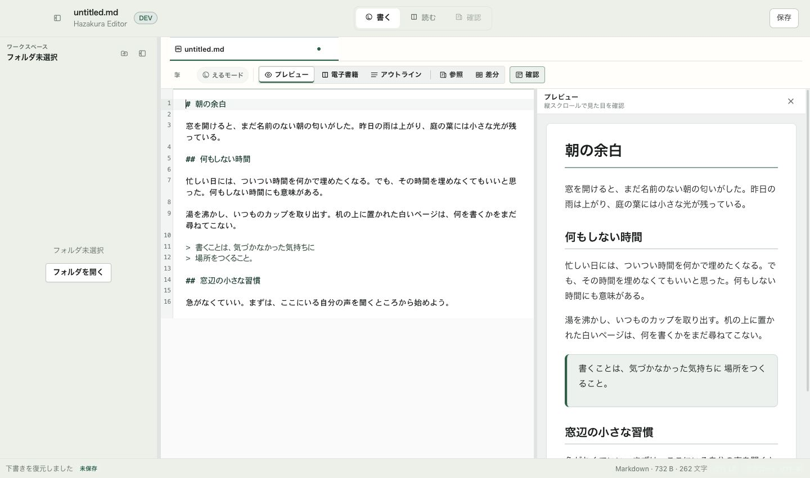

# v3 UI-A1 — 共通外枠と文書ナビのレビュー

Status: Ready for first implementation review; not release-ready
Scope: UI-A0/A1。通常編集画面02の外枠と目的別ナビ
Authority: Review evidence
Last reviewed: 2026-09-09

## レビューしてほしいこと

通常編集の操作が一列に混在していた配置を、上段の文書ナビ/保存、文書タブ、
表示ツールの3段へ分けた。既存の保存・編集・右ペイン・Local Assist提案確認へ接続している。
他の画面へ横展開する前に、次の3点をレビューしてほしい。

1. 「書く・読む・確認」と、下段のPreview/電子書籍/参照/Diffの併存は理解できるか。
   目的別入口と細かい表示設定の二層でよいか、下段をさらに整理すべきか。
2. 「確認」の0件/1件/複数件の扱いに、対象の取り違えや行き止まりがないか。
   AI提案は既存の浮動Diffへフォーカスする。確認クリックだけでは反映しない。
3. 3段の高さ、タイトル/サイドバー/保存の位置は通常編集の土台として妥当か。
   native traffic light、ドラッグ、IME、VoiceOverは追加の実機確認が必要。

## 対象と変更

- ブランチ: `codex/v3`。基点: `a94623b710a299e1653a3160411e2b184c682a08`。
- 差分確認: `git diff a94623b7...codex/v3`。UI実装の最初の統合は `19cac440`、対象識別/保全の検証は `43c6804b`。
- 上段に実文書名、workspace名、書く/読む/確認、既存Companion入口、保存。
- タブを文書領域へ移し、sidebarはタブより上から始まる。設定値とペイン幅を保持。
- 読むは現在文書のe-bookへ移動し、再選択しても閉じない。書くは編集へ戻る。
- 確認はAI提案、保存前変更、参照、開いている比較から選ぶ。複数なら対象名を併記。
  対象の変更時はpopoverを閉じ、EscapeはIME変換と区別する。
- 画像閲覧中/独立Reader中は上段ナビ・保存を無効化。Assist生成lock時も保存不可。
- App Storeで外部CLI Agentを出さず、Local Assist利用不可時の説明を保持する。

[配置・遷移契約](../../v3-ui-a0-navigation.md) / [全体計画](../../v3-product-completion-plan.md)

## 画面

実装画面は日本語、実CodeMirror/Preview、サンプル「朝の余白」。
ブラウザーfixtureでテーマ/言語を指定し、アプリ自身の下書き復元から表示した。
ファイルを偽装して開いた状態にはしていないため、無題・未保存、workspaceなし、Assistオフ。
Developerブラウザー表示のため1440幅にはDEVがある。nativeウィンドウの写真ではない。

[ダーク1440×850](dark-1440.png) / [ダーク960×640](dark-960.png)

## 確認結果

- `npm run typecheck` 成功。
- `npm test` 全237ファイル、2,075件成功。
- `npm run smoke:app-store-surface` 10ファイル、111件成功。新しいtoolbarの配布境界は全体テストにも含む。
- `npm run build` のローカルApp Store preview（ad-hoc署名）成功。Vite buildと既存Swift helper buildを含む。
  既存の大きなJS chunk警告あり。App Store提出・公証・公開の証拠ではない。
- `git diff --check` 成功。
- ブラウザー: 読むの再選択、書くへ戻る、本文編集後の往復とUndo、L Modeへの出入り、
  既存クイック設定/Command Paletteへの到達を確認。dark 960×640で横はみ出しなし、保存が画面内。
- 対象選択、同名別セッションへの移動、対象名表示、IME Escape/focus、保存無効化、
  App Storeの外部Agent非露出は自動テスト。Reader開閉中にEditor DOMを保つことも検証。

## 未完了と次の区切り

これは外枠の実装レビューであり、24画面の完成判定ではない。
Previewの紙面/書体、sourceの余白、sidebar内容、書き出しの統合入口はUI-B/D/Eで扱う。
新しいフォント/行間の永続設定、別窓再設計、Local Assist内部の再編は今回未実装。
モデルのDL/管理/切り替えはv3.1のまま。

native drag/traffic light、実機IME/VoiceOver、実AI、旧OS、全7テーマ、画像/Book/参照の
native往復、実ファイルの保存と再起動はこのスライスでは未確認。
ビルド済みアプリを選択した際に既存起動アプリへ接続されたため、それを今回のnative smoke成功と扱わない。
詳細は[design QA](design-qa.md)。レビュー反映後にUI-B（通常編集/Previewの紙面）へ進む。

外部への送信、PR作成、mainへのmerge、配布物の提出はこの記録に含まない。
