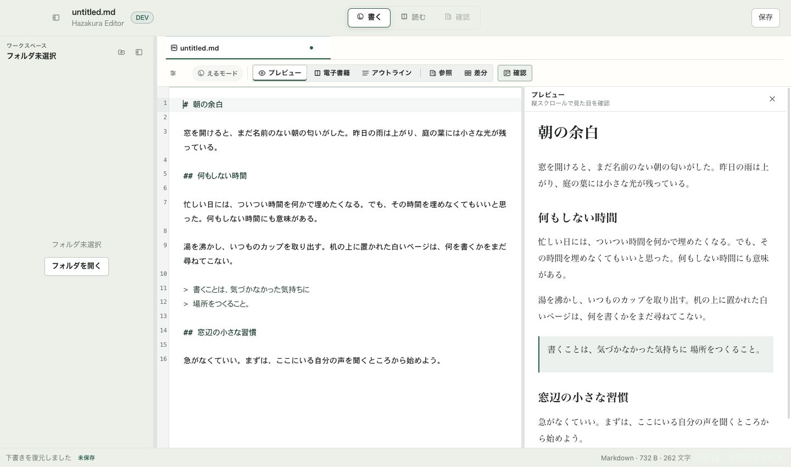

# UI-B1 — 通常紙面と狭幅表示

Status: Ready for focused review; not release-ready
Scope: 通常編集02/19/23の紙面と狭幅切替。UI-B全体の完了ではない
Authority: Review evidence
Last reviewed: 2026-09-09

実装コミット: `1c380184`。基点: `68d05f85`、ブランチ: `codex/v3`。
UI-A1のR1/R2は外部再レビューでCLOSED。UI-Bへ進むオーナー依頼を受けた区切り。

## 変更と見てほしい点

- 通常Editorを残り高さへ伸ばし、短い文書の背景が途中で切れる状態を解消。
  既存等幅書体・文字サイズは保持し、行高1.85、上余白12–24pxで読みやすくした。
- 右Previewの外側のカード枠・影・二重余白を除去。既存の明朝スタックを使い、
  行高2、読み幅最大46em、左右18–40px、低い窓では上12px/下28px。
  テーマ別の読む面・選択色、renderer・画像許可・リンク・表/コードの処理は保持。
- 文書領域が780px以下のとき、編集/Previewを一面ずつ表示する。
  一時的な表示選択だけをAppShellに置き、上段「書く」でも編集へ戻れる。
  両方のDOMは保持し、広げると保存済み分割幅へ戻る。幅や表示設定を永続的に上書きしない。
- 参照・Diff・電子書籍・本全体Reader・L Modeには狭幅切替を適用しない。
  新しい書体設定・フォント取得・保存処理・AI/runtime・配布設定の変更はない。

レビューの焦点は、紙面の行間/余白、狭幅切替を追加した位置、780pxという文書幅の閾値。
追加の切替行は約39pxを使う。960×640でsidebarを開いた場合も本文は約408px確保できるが、
更なる操作列の追加は避ける。開始画面01/えるモード03の再設計はUI-B2に残す。

## 画像

実アプリをViteで動かしたブラウザー画像。nativeアプリのスクリーンショットではない。
自作の「朝の余白」を下書き復元から開いた未保存文書。初期文字は既存設定14px/15px。
dark画像には長い表等の追加fixtureも含む。写真のデモ章番号などは実装に入れていない。

[ダーク1440×850](dark-1440.png) / [960×640 編集](compact-edit.png) /
[960×640 Preview](compact-preview.png) / [960×640 最大文字設定](compact-large.png)

## 確認結果

- `npm test`: 238ファイル、**2,081テスト成功**。新規3件。
  狭幅切替のコールバック、他Readerへの非露出、AppShellの「書く」で編集へ復帰する状態とDOM保持。
  最初の切替テストは実装前に失敗を確認。CSSの見え方はjsdomの合格から推定しない。
- `npm run typecheck` / `npm run build:vite` / `npm run build`成功。
  最後は既存helperを含むローカルApp Store previewのad-hoc署名ビルド。
  大きなJS chunk警告あり。nativeソース未変更のためRustテストは再実行していない。
- `npm run smoke:app-store-surface`: **111テスト成功**。
- ブラウザーの実AppShell経由で960×640の編集/Preview切替、上段「書く」、
  1440幅へ復帰して両面表示と58/42の幅保持、試験追記のUndoを確認。
- 文字設定の最大値22px/24pxで横はみ出しなし。長い表・コード・URLが外枠を広げず、
  コードは局所スクロール。未許可画像は既存の理由/次の操作を表示した。
- 集中Reader中のsidebarのcomputed displayはnone、AX treeにも非露出。
  R3の推奨CSSと同等のルールは既にworkspace.cssにあるため重複追加していない。
  L Modeで浮動タブがAppShell直下に残り、新しい狭幅切替が出ないことを確認。
- `git diff --check`成功。上記はローカル証跡であり、GitHub Actions成功の報告ではない。

## 残る受入と次

今回の再ビルド後のnative実操作、IME未確定変換、VoiceOver仮想カーソル、200%表示、
全テーマ、選択範囲/長文スクロール位置の厳密な往復比較は未実施。
最大文字設定のテストを200%試験の代わりにしない。
R1/R2の前スライスnative証跡は当時のもので、今回の変更のnative合格へ繰り越さない。
署名配布候補・Apple提出・公証・公開は未実施。

この紙面を再レビュー後、UI-B2で開始画面とえるモードを整える。
