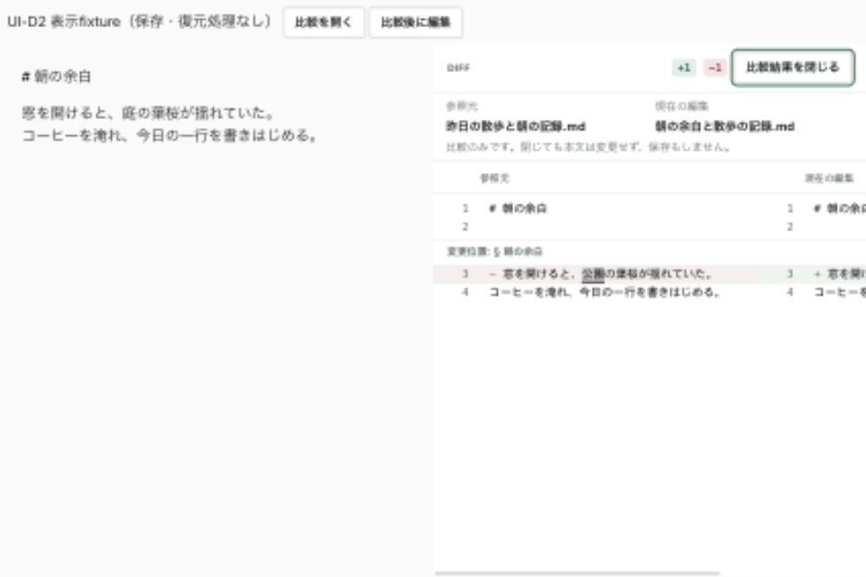
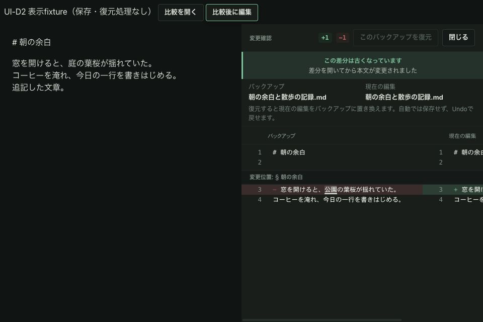

# D1-R1修正・UI-D2a 合評資料

Status: Local verification complete; external/native acceptance pending
Scope: Backup review gate and comparison surface
Authority: Review evidence
Date: 2026-09-10

対象は`codex/v3`、前回`7fc46ac9`からの変更。
C2-R1はオーナー提供再レビューでCLOSED。画像/バックアップPickerはGO。
今回の修正のCLOSED判定は外部再レビュー待ち。

| コミット | 内容 |
| --- | --- |
| `3de6b926` | D1-R1: read完了とApply直前のsnapshot検証、stale復元無効化、実Editor経由のUndo。重複clearも削除 |
| `aeb697f7` | D2a: 比較対象表示・初回focus、disk比較のsession再検証、低い画面の高さ配分 |

## D1-R1の確認点

- tab ID/session/本文/encoding/改行と対象pathを照合。snapshotなしも拒否する。
- 非同期read中に本文・active tab・workspaceが変われば比較を作らない。閉じたsessionや古いread結果も採用しない。
- Applyボタンだけでなくhandlerで再検証する。Reactにまだ反映されていない実Editor本文も照合する。
- 有効な比較だけ既存`replaceDocumentContents`へ渡す。read-only/Assist-lock/IMEの既存拒否を維持。
- 成功時だけ比較を閉じる。拒否時は本文を変えず比較を残し、再比較を促す。保存はしない。
- 実CodeMirrorテストで復元→同じ古いclaimの再実行拒否→1回のUndo、元本文/dirty復帰、Editor DOM同一性を確認。

## D2aの範囲

参照・バックアップ・disk比較の左右を実モデルから表示。重複した文書名のヘッダーを整理し、
readonly比較とバックアップ置換の説明を分ける。新しいApply経路は増やさない。
比較を開くとCloseへfocusし、stale更新等の再描画ではfocusを取り直さない。
モーダル・hidden/inert・CSS非表示面ではfocusを取らない。
保存衝突のdisk readは同一pathでもsessionが変われば結果を破棄する。

**D2全体完了ではない。** 保存衝突ダイアログはD2b。
既存`keepEditingAfterConflict`は衝突状態を消すため、ダイアログを閉じる操作へ流用しない。
今の比較Closeは比較を閉じるだけで、本文の保存・衝突解消を行わない。

## ローカル証跡

- frontend: 247ファイル / 2,144テスト成功。staleボタン4件とsession再open拒否は修正前失敗を確認。
- 対象UIの最終マークアップ変更後、focused 11件成功。
- App Store表示境界: 111件成功。
- typecheck / Vite / App Store native preview build成功。
- Rustは今回変更なし、再実行なし。前回383件を今回実行結果には数えない。
- jsdom canvas未実装通知、既存のVite大chunk警告あり。今回テスト失敗なし。
- CI workflow/status成功の証跡として扱わない。

## ブラウザー表示確認

[fixture](fixture.html)は実DiffPaneを使う表示専用fixture。サンプル本文でありnativeバックアップreadや保存は実行しない。
Viteでこのページを開ける。`?view=backup&theme=dark`で「比較後に編集」を押すとstaleになる。

- 960×640、参照light / backup darkの表示を確認。ページ全体の横overflowなし。
- 初回Close focus、編集後の復元disabled、編集ボタンにfocusが残ることをDOMで確認。
- 狭いDiff内の左右表示は既存の水平スクロールを維持。全アプリ外枠込みのnative受入ではない。
- 比較本文は残り高さを使う。stale警告を出したbackup fixtureで389pxを確保。

## 次の受入

1. nativeバックアップread中の編集/切替/closeと、比較後の編集で復元を拒否すること。
2. nativeで再比較→復元→Undo、保存しないこと。
3. 比較入口からのfocusとVoiceOver読み順、200%表示。
4. D2bの保存衝突Close/Escapeで衝突保持、Save As・比較への明示移動。

実System、native窓間操作、実IME、VoiceOver、200%表示は今回未受入。
