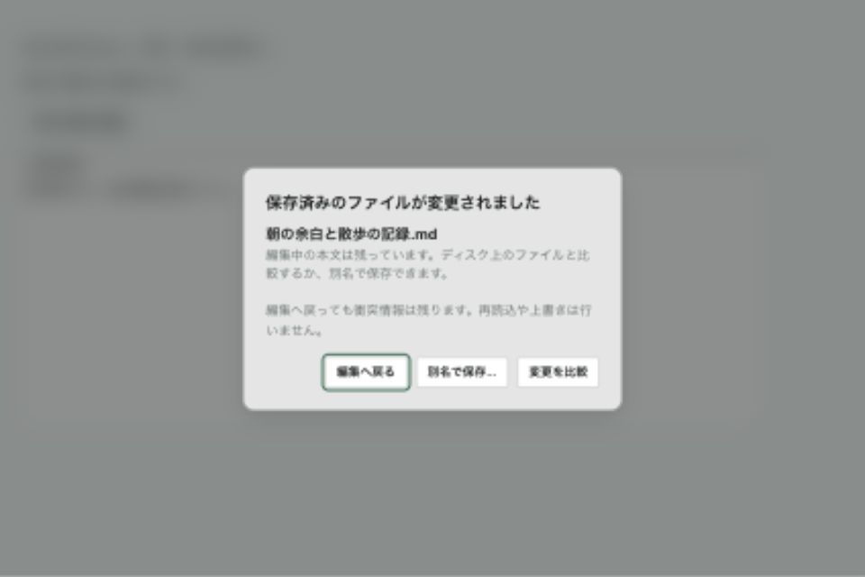
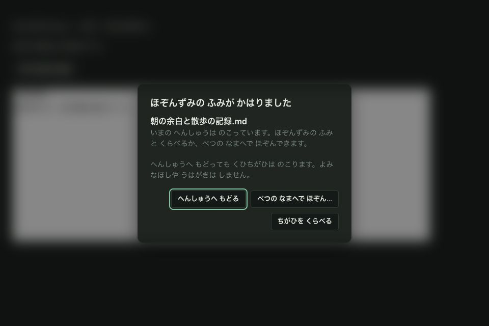

# UI-D2b・比較後focus 合評資料

Status: Local verification complete; external/native acceptance pending
Scope: Save conflict presentation and transient-surface focus
Authority: Review evidence
Date: 2026-09-10

前回`68fe8487` → 実装`eb12766e`、ブランチ`codex/v3`。
オーナー提供再レビューでD1-R1 CLOSED、D2a GO。今回のD2bは外部受入待ち。

## 変更

- backup比較の左対象に実`backupName`を表示。架空の日時を作らない。
- 比較Close/正常な復元後はEditorへfocusを戻す。別モーダルが開いているときは奪わない。
- 保存衝突に「編集へ戻る」「変更を比較」「別名で保存」の一時surfaceを追加。
- 戻る/Escapeは表示stateだけを閉じ、本文・衝突・dirtyを変更しない。
- 比較とSave Asは既存の読込/保存経路へ接続。自動reload/上書き/保存は追加しない。
- dismissはsession/path/disk fingerprint/error単位。通常編集では再表示せず、新しい衝突やsessionで再表示する。
- 閉じた後も既存の衝突bannerから再表示できる。従来の明示reload/close/keep-editing操作は残る。
- dialogはbody portal、背景をinertにしてEditor DOMを保持。Tab循環・IME Escape除外。
- global keyboardのmodal guardへ接続。nativeメニューはinertを通らないため文書操作イベントも停止する。
  通常のQuit確認は許可。他の既存dialog/palette/search/quick-open/backup-pickerを優先する。

## ローカル検証

- frontend: 248ファイル / 2,150テスト成功。
- App Store表示境界: 111件成功。
- typecheck / Vite / App Store native preview build成功。
- Rustは変更・再実行なし。CI workflow/status成功の証跡には数えない。
- 実CodeMirrorの復元後focusを待ち、`document.activeElement`へUndoを送り、元本文/dirtyとDOM同一性を確認。
- AppShellテストでportalと背景inert、Escapeの操作振分け、比較/Save As、Editor DOM維持を確認。
  このAppShellテストのEditorは軽量fixture。上の実CodeMirrorテストとは別の証跡。
- hookテストでdismissによる文書不変、通常編集での非再表示、新session/新diskでの再表示を確認。
- jsdom canvas通知と既存Vite大chunk警告あり。テスト失敗なし。

## ブラウザー表示

[fixture](fixture.html)は実dialogとdismiss hookを使う表示fixture。native保存/読込はしない。
960×640、日本語light/かなdarkを確認。アクセシビリティツリーに背景本文が出ず、
最初のfocusは「編集へ戻る」。戻るクリック後は本文にfocusし、未解決表示と本文が残る。
全アプリ/native/VoiceOver受入と同一視しない。

## 外部レビュー / 次の受入

1. Close/Escapeで衝突を消すcallbackへ流れないこと。本文・Undoも維持すること。
2. 比較は既存stale境界、Save Asは既存session/保存境界を使うこと。
3. nativeでSave As取消/成功後のfocus、比較Close/復元直後の⌘Z。
4. IME、VoiceOver、200%表示、別modalとの往復。これらは今回未受入。

次はD2b合評/native受入とUI-E。画像倍率・復元比較一体化・C2の実System通し受入は別に残す。
