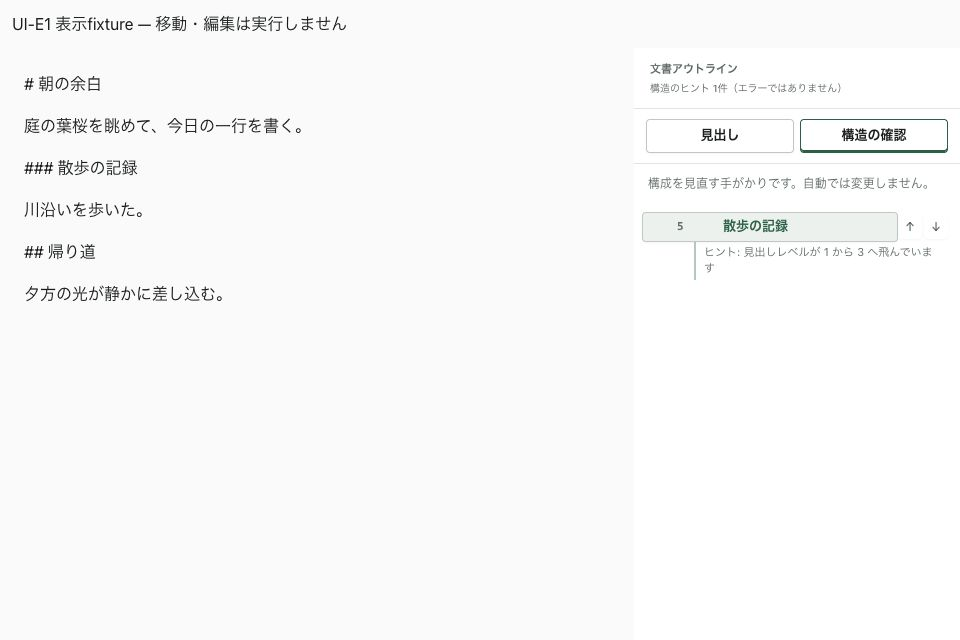

# D2b追修正・UI-E1 合評資料

Status: Local verification complete; external/native acceptance pending
Scope: Unresolved conflict preservation and structure surface
Authority: Review evidence
Date: 2026-09-10

前回`995dab9c`から、`11e33fb7`（衝突修正）と`938f92e8`（UI-E1）を追加。

## D2b追修正

- 実入力reducerでconflict/errorを保持。通常入力は衝突の承認にならない。
- Save As失敗は現在の同一sessionがconflictならtabを変えず、globalError/statusで失敗を通知する。
  他sessionを同じtab IDだけでerrorにする経路も止める。取消/成功は既存経路を維持。
- dismissはsessionごとのMap。別タブへ移っても保持、明示reopenは現在sessionだけ解除。
- バックアップ左側には実backup名を表示し、元文書pathをtooltipとして渡さない。

通常入力とSave As失敗のテストが修正前に失敗することを確認してから修正した。
追加した実CodeMirrorテストはReturn→1文字入力→conflict/error維持→dialog非再表示→DOM同一性まで通す。
Save As失敗のmock I/Oテストと、実typing reducerを通すA→B→Aのdismissテストも追加。

## UI-E1

既存Outlineに「見出し」「構造の確認」の切替を追加。
既存解析のadvisoriesがある位置だけを構造面に表示し、0件では確認事項なしと示す。
現在位置・本文への移動・明示的な見出しレベル変更を残す。自動修正/新しい解析は追加しない。
上限到達時の案内は確認事項0件でも残す。ja/kana/en対応。

受入テスト: 切替だけでは移動/編集callbackを呼ばない、該当位置へ移動、
手動promoteが元のitemへ渡る、上限表示を維持。既存の構造編集/Undoテストも全体実行に含む。

**順序訂正:** 前回の引き継ぎの「UI-E設定」は誤記。正本ではUI-Eが読む/検索/構成/出力、設定はUI-F。
今回独立して進めたのはE1の構造面だけ。UI-E全体は未完了。

## 検証

- frontend 248ファイル / 2,155テスト成功。
- App Store表示境界111件、typecheck/Vite/native preview build、codesign verify成功。
- Rustは変更/再実行なし。GitHub CI成功として扱わない。
- jsdom canvas通知・既存Vite大chunk警告あり。テスト失敗なし。
- [表示fixture](fixture.html)の960×640で構造確認への切替を確認。
  実parser/Outlineだが移動/編集はnoopで、nativeの実操作受入ではない。

## 次の確認

1. D2b追修正のCLOSED判定。通常入力・Save As失敗で元の未解決衝突を保持すること。
2. native Save As取消/成功・IME・VoiceOver・200%。今回未受入。
3. UI-E1の構造移動→手動レベル変更→Undo、長い文書での現在位置/スクロール。
4. UI-Eの検索・読む→章編集・出力導線を機能別に進める。
