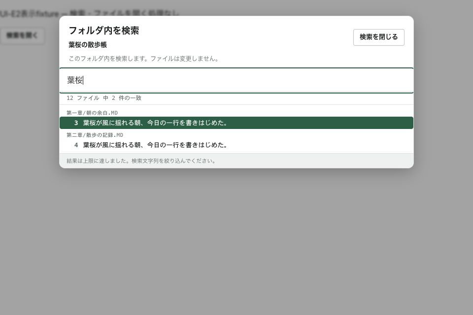

# Save As通知修正・UI-E2合評資料

Status: Local verification complete; external/native acceptance pending
Scope: Error attribution and workspace search surface
Authority: Review evidence
Date: 2026-09-10

前回`ee3eb8df` → `1f0158a5`（通知修正）→ `7da932ab`（検索面）。
外部レビューで前回D2bの4指摘CLOSED、E1 GO。今回の追加P2/E2は再レビュー待ち。

## 通知修正

Save As失敗をglobalErrorへ残さず、対象文書名と理由を含むstatusへ通知する。
既存の同一sessionへの通常error保存と、conflict保持の条件は維持する。
失敗した別名保存は、元ファイルの衝突を解消する操作ではない。

修正前に2件の失敗を確認。Save As mock I/Oから`useEditorTabState`へ結果を渡し、
A conflict→失敗→B、およびA conflict→失敗→明示解除後の状態でactiveErrorがnullとなることを検証。
明示解除後のtab状態はテストで与える。解除handler自体を変更/再実装していない。

## UI-E2の範囲

- 検索対象フォルダ名とローカル範囲の説明を入力近くへ常設。workspaceRootPathの実basenameを渡す。
- Closeボタン、入力/CloseのTab循環、CloseからのEscapeを追加。結果選択は既存のArrow/Enterを使う。
- 検索Closeは既存Editor focus経路へ接続。別モーダルからfocusを奪わない既存ガードを維持。
- query/rows/summary/error/searchingを複製しない。新検索条件・索引・書換え・Reader検索stateは追加しない。
- 検索中/0件/失敗/上限案内と、選択結果を開く既存経路を維持する。

UI-E2は検索面の区切り。読む→章編集の刷新は次のE3。
既存findMatches→searchSourceLineによるReader内位置移動は変更せず、関連既存テストを全体実行に含む。

## ローカル検証

- frontend 249ファイル / 2,159テスト成功。
- App Store表示境界111件、typecheck/Vite/native preview build/codesign verify成功。
- Rust変更/再実行なし。CI workflow/status成功の証跡ではない。
- 新規UIテスト: 実対象フォルダ、Closeで結果を実行しない、IME Enter除外、選択rowをEnterへ渡す、上限案内。
- [fixture](fixture.html): 実GlobalSearch + サンプルrows。native検索/ファイルopenは実行しない。
- 960×640で対象名/検索語/結果/上限表示、TabでCloseへ移動、Escapeで閉じることを確認。
  fixtureには実Editorへのfocus復帰を配線していないため、実アプリの復帰受入とは別。
- jsdom canvas通知・既存Vite大chunk警告あり。テスト失敗なし。

## 次の受入

1. Save As通知が別タブや衝突解除後のバナーへ漏れないこと。
2. native検索→実一致位置→Reader/編集、検索Close後のfocus、連続query変更。
3. 読む→章編集、Save As取消/成功、IME/VoiceOver/200%は今回未受入。
4. UI-E3は既存の位置同期を使い、検索や本文の正本を増やさない。
