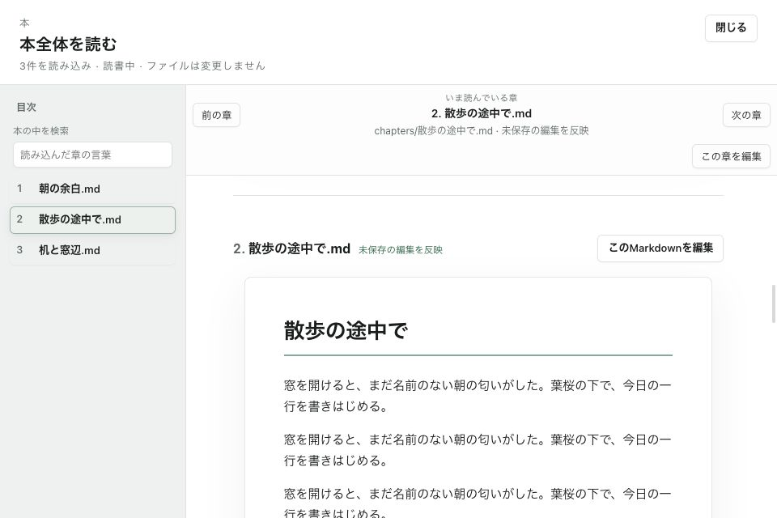
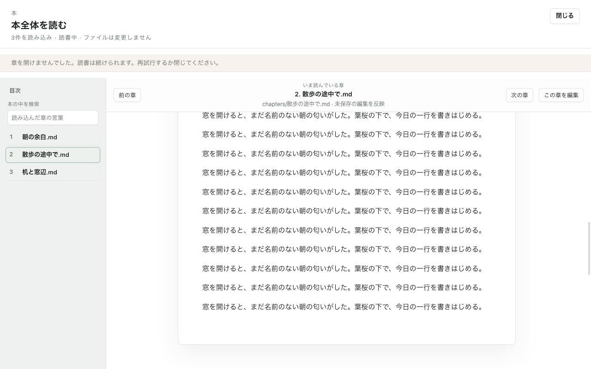

# UI-E2検索修正 + UI-E3本全体Reader

Status: External review requested
Scope: `13eae5ba` → `15ce3a7f` → `3dfb10c5`（製品コード）
Last reviewed: 2026-09-10

## 今回の確認対象

前回Save As通知のP2はオーナー提供レビューでCLOSED。
検索のP2×3を修正し、隣接する本全体Reader→章編集までまとめた。
今回の修正に対する外部CLOSED判定はまだ受けていない。

- `15ce3a7f`: query変更時にrows/summary/indexを即座にリセット。空query・Close・workspace変更・unmountで旧要求を失効し、searchingを終了する。新query待ち中は旧結果を表示/Enter実行しない。
- 検索openは既存`openWorkspaceFile`から成功したEditorTabまたはnullを返す。成功時だけ、遅延後にも最新試行/session/pathを照合して`goToLine(..., {focus:false})`とOpenedを実行する。検索Close/query変更で旧位置移動も失効する。
- `3dfb10c5`: 検索結果のpointer操作も既定のfocus移動を抑制。本全体Readerの現在章バーに相対path・未保存編集を含む旨・「この章を編集」を常設。
- 章編集は既存open成功後だけReaderを閉じる。表示復帰の次フレームでsession/要求/別modalを再確認し、対応文書の先頭へ移動してfocusする。失敗時はReaderと再試行操作を残す。
- 本内検索EnterとReader EscapeはIME変換中に実行しない。既存の章検索・位置記録・本文描画を使い、かな表示も揃えた。
- Reader外枠はflexで残り高さを本文へ配分。通知が0件でも複数でも固定の空行を作らず、960pxでは編集操作を折り返す。

## 境界と今回含まないこと

本全体Readerは章の**文書先頭**へ戻る。本文の任意の読書位置をsource行へ変換する新機能ではない。
単文書e-bookの既存sourceLine/ページ位置の橋渡し、findMatches→searchSourceLineは変更していない。
Book Scope並替えUIの全面改装、見開き再設計、書誌meta永続化は後続。
元文書・保存・Undoの所有者、Assist、Rust command、依存、版数は変更なし。

## 検証（すべてローカル）

| 項目 | 結果 / 範囲 |
|---|---|
| test-first | 検索hookの新規4件が修正前に失敗、修正後成功 |
| frontend | 250ファイル・2,170件成功（前回2,159件から+11） |
| App Store surface | 10ファイル・113件成功（検索controllerの失敗/session交代を2件追加） |
| typecheck | 成功 |
| Vite | native preview build内のtypecheck/Vite build成功 |
| native preview | App Store previewビルド成功、codesign deep/strict verify成功。公証/アップロードなし |
| Rust tests | Rust変更なし・今回は再実行なし |
| UI表示 | 実BookScopeReaderのfixtureを960×640、1280×800で目視。目次選択→現在章/path追従、模擬open失敗後のReader保持を確認 |
| CI | GitHub CI成功の証跡としては扱わない |

検索テストは同数の連続query、遅い応答のClose/空query/workspace失効、open失敗、session交代、旧結果のEnter禁止を固定。
実`useFileOpening`の失敗戻り値とcontrollerの成功判定をそれぞれ検証している。
ReaderはBook Scope入口から実Readerを開くAppWorkspaceテストで、成功/失敗、文書列のhidden/inert、EditorホストDOMの同一性、復帰時のgoToLineを検証。
**このAppWorkspaceテストのEditorはmock**。native focus、実CodeMirrorでのReader復帰直後の入力/Undoを今回証明したものではない。
canvas未実装のjsdom警告あり、全テスト成功。新しい安全性や実機品質の包括的な合格を主張しない。

## 表示資料

[fixture](fixture.html)はVite経由で開く。実Reader/Preview部品と架空の3章を使用。
「この章を編集」は意図的にfalseを返す表示確認用で、native I/Oは行わない。

## 再レビューと次のまとまり

1. 検索の3指摘が解消し、query/Close/open失敗で旧結果の操作やfocus移動が残らないか。
2. 本全体Reader→章編集の成功/失敗境界、現在章の対象表示、狭幅の高さ配分。
3. 次はUI-Eの出力/取り込みをまとめて整理し、その後UI-F設定へ。UI-E全体はまだ完了扱いにしない。

未受入: native実検索→結果Enter連続操作→Close→読む→章編集、実CodeMirrorの復帰直後入力/Undo、実IME、VoiceOver仮想カーソル、200%、native Save As取消/成功、Local Assist実System窓間操作。
