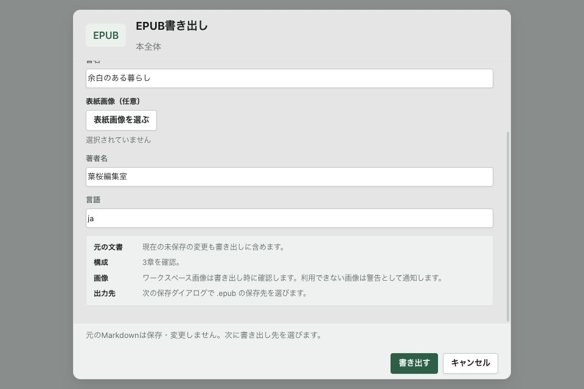
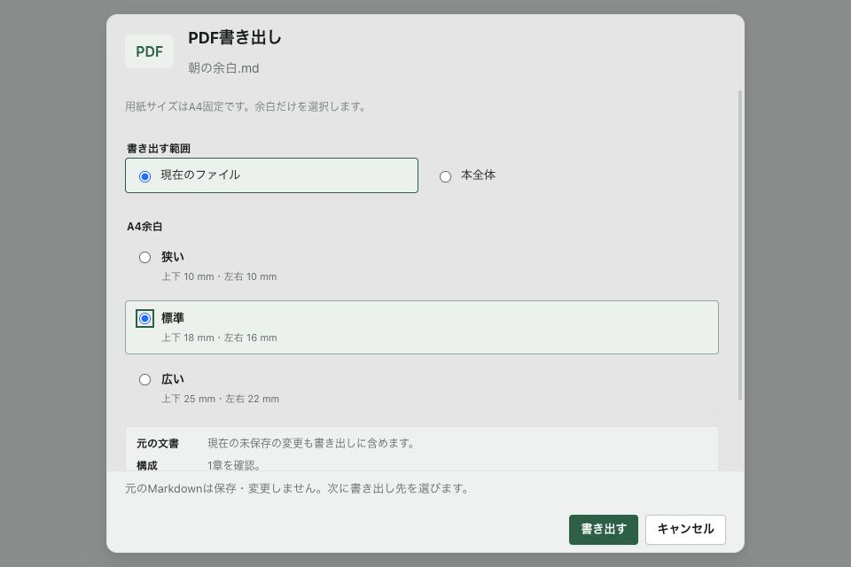

# E2/E3競合修正 + UI-E4a書き出し外枠

Status: External review requested
Scope: `2e38f3e8` → `88b8613b` → `5e897c21` → `d52e7f9d`（製品コード）
Last reviewed: 2026-09-10

## レビュー指摘への対応

前回の検索P2×3は標準経路では外部確認済み。今回のR1〜R3は以下で修正し、再レビューを依頼する。
外部CLOSED判定やnative受入を済ませたという意味ではない。

| 指摘 | 修正と検証 |
|---|---|
| R1: 古いopenが後からactive tabを変更 | `OpenTextFileOptions.isCurrent`を検索から実openへ渡す。読込・bookmark待ち後、タブ登録/active化/比較解除/status反映より前に検査。失効した失敗もglobalErrorへ反映しない。A→B→B完了→A完了でBを保持 |
| R2: 未登録sessionを返す | 同じpathのin-flight読込を共有。最新tabsと、同一React batch内で登録したタブを参照し、既存sessionを再利用する。同一未開封ファイル10→20行で20行へ移動。制約のない並行openにも登録sessionを返す |
| R3: 初期復元が手動移動を上書き | 初期復元のattemptとtimerをrefで管理。目次・前後章・検索Enterで取消。残る120/400/900/1600msの処理を進めても旧章へscrollしない |

R1/R2のテストは**検索controller＋実useFileOpening＋Reactのtabs/activeTab state**を接続。
openTextFileのI/OとEditor goToLineはmockだが、今回問題になったタブ追加/active化/重複排除はmockしていない。
最初の3件は修正前に失敗、修正後に成功。Close・query変更中のopenも結果を反映しない2件を追加した。

Readerの3経路も修正前の実部品で失敗、修正後成功。
wheel/touch/pointer/スクロール用キーという利用者入力でも復元を終了する。
復元自身のscrollイベントでは取り消さない。Observerの位置追従や既存の保存位置モデルは残す。
Reader章openにもisCurrentを渡し、Closeや次の要求で失効したopenが背後を切り替えないようにした。

## UI-E4a: EPUB/PDF

- `ExportDialogFrame`を共通外枠に採用。形式表示・対象・設定スクロール・固定フッターを整理。
- EPUBの書誌/表紙、PDFの余白、scope、preflight、各writerは既存の所有者のまま。
- 本全体選択時のヘッダーは「本全体」。現在ファイル名を本全体の名前として表示しない。
- 確定は既存の必須項目/preflightに加えscopeの利用可否も検査。disabled表示だけでなくform submitでも拒否する。
- 元Markdownを保存/変更せず、次に出力先を選ぶ旨をja/kana/enで常設。
- **形式を同じ窓内で切り替えるUI、HTMLの新設定面、Importの再配置は未実装**。今回は2形式の共通外枠まで。

## 検証（ローカル証跡）

| 項目 | 結果 |
|---|---|
| frontend | 252ファイル・2,180件成功（前回2,170から+10: open統合5、Reader3、export2） |
| App Store surface | 10ファイル・113件成功 |
| typecheck | 成功 |
| Vite / native | App Store preview build内のtypecheck/Vite/native build成功 |
| codesign | deep/strict verify成功。公証/Apple uploadなし |
| Rust | fmt check成功、383件成功・2件ignored。Rustコード変更はないがI/O隣接のため再実行 |
| ブラウザー | 960×640のEPUB/PDFを目視。本全体切替で対象/章数追従、本文だけスクロールしてフッターを保持 |
| CI | GitHub CI成功の証跡は今回取得していない。ローカル成功と区別 |

jsdomのcanvas未実装警告あり、全テスト成功。
今回の外枠変更後にEPUB/PDF成果物を実際に書き出して原寸比較したわけではない。
native実検索、Reader往復直後の実Editor入力/Undo、実IME、VoiceOver、200%、Save As取消/成功、Local Assist実Systemは未受入のまま。

## 表示fixture

[fixture](fixture.html)をVite経由で表示。`?format=pdf`でPDF。
実部品と架空のpreflight/文書名を使う。確定/キャンセルはfixtureを閉じるだけで、picker/writer/native I/Oは呼ばない。

## 次の区切り

1. R1〜R3と共通外枠の合評。特に実open前後の失効、並行open返却session、復元終了条件を確認。
2. UI-E4b: HTMLと取り込みの既存導線を整理。確定前Importステージや新規writerを混ぜない。
3. UI-F設定、UI-G横断受入へ。Reader/本構成一覧の全面刷新は今回完了扱いにしない。
