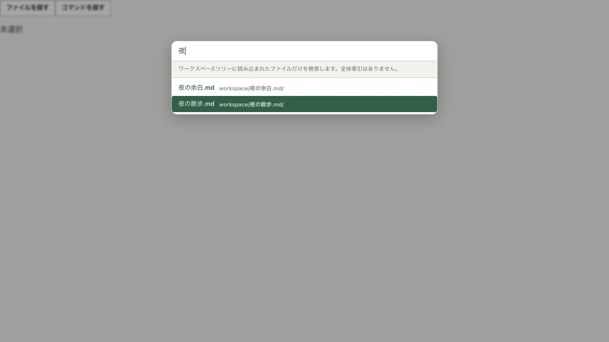
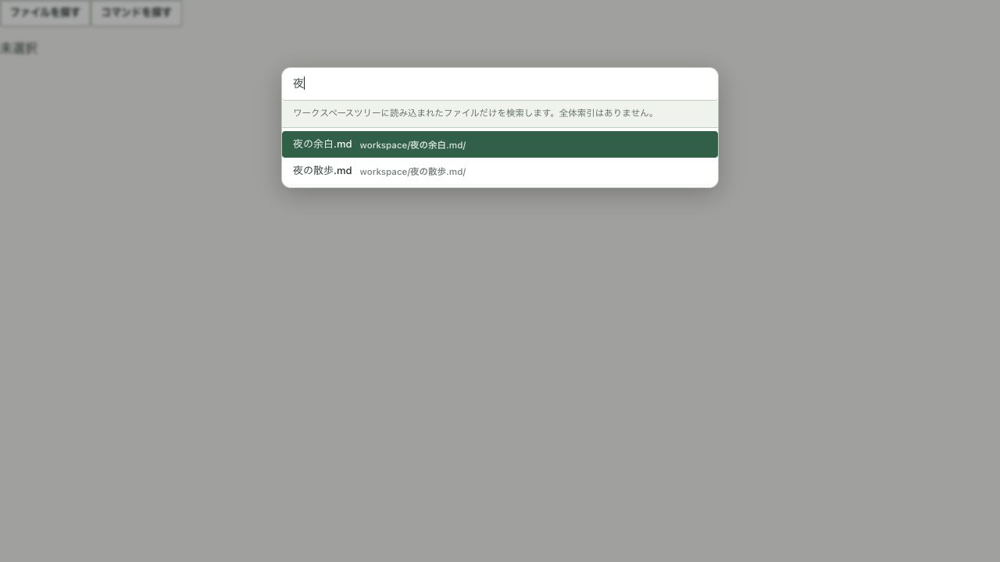

# v3 日常操作の最終調整

Status: Review record
Scope: 開始・編集復帰・検索・書き出しの操作継続
Date: 2026-09-12
Reviewed source: `a58dd78e` + この作業の未コミット差分

## 結論

紙面と周辺UIの分離、書く／読む／確認の位置、書き出しの形式ナビは一貫している。
今回確認したライトの1440×850・960×640、ダーク設定の960×640では、主要操作の
重なりや枠外へのはみ出しは見られなかった。見た目を再設計せず、操作が途切れる4点を修正した。

これは **ブラウザでの現行React/CSSの確認**。既存の
`../2026-09-11-v3-shell-look/fixture.html` は実際の `App` を描き、ネイティブ呼び出しをスタブ化する。
検索はこのディレクトリの `search.html` が実コンポーネントと架空の4ファイルを使う。
ファイル保存・native picker・macOS WKWebView・実機IMEの試験とは区別する。

## 確認した流れと修正

1. **新規ファイル → そのまま入力（修正）**
   開始画面で新規作成しても `document.activeElement` が `BODY` に残り、入力が本文へ届かなかった。
   作成成功・既存タブの再利用時だけ既存のフォーカス処理を呼ぶ。フォルダの再読込完了を待たずに
   書き始められ、取消・失敗時はフォーカスを動かさない。修正後は追加クリックなしで入力できた。
   [修正前](new-document-before.png) / [修正後](new-document-after.png)

2. **編集 → 読む → 書く（修正）**
   読書面から閉じる処理は、編集領域がまだ `hidden` / `inert` の間に `goToLine(..., { focus: true })`
   を呼んでいた。復帰位置を一度保持し、DOMの表示復帰後に位置とフォーカスを戻す。
   別の文書やモーダルへ移った場合はフォーカスを奪わない。上部「書く」の重複した処理も整理した。
   修正後の実操作で `cm-content` への復帰を確認。[読書画面](reader.png) / [狭幅の編集](editor-960.png)

3. **検索語 → 2件目へ移動 → 同じ件数の別検索（修正）**
   「朝」の2件目を選んで「夜」へ変更すると、2件という数が変わらないため選択行が残った。
   Quick OpenとCommand Paletteで検索語変更時に先頭候補へ戻す。Quick Openは照合を1回にまとめ、
   総件数と上限内の表示結果を同じ結果から導出する。0件で下キーを押しても負の選択位置にしない。
   修正後は「夜の余白.md」が選ばれ、Enterでそのファイルのコールバックが1回実行された。

   
   

4. **書き出す → EPUB/PDF/HTMLを切替 → 取消（修正）**
   書名は形式の往復で保持され、Escapeで終えた後の再オープンでは初期値へ戻ることを確認。
   ただし取消後のフォーカスは `BODY` に失われたため、書き出し操作全体で元の操作位置を保持する。
   入力の `autoFocus` より前の位置を覚え、形式切替中は保持し、終了時だけ復帰させる。
   復帰先が非表示・切断済み、または別モーダルがある場合は戻さない。
   実操作でキーボードから開いた書き出しをEscapeで閉じ、元の書き出しボタンへ戻ることを確認。
   [960×640の書き出し](export-960.png) / [復帰後](export-return-after.png)

## 周辺確認と境界

- 日本語の閉じるラベルの余分な濁点を修正。
- 設定上部の `Settings / Help` は英語のまま。`helpDocs/index.ts` に明示された英語統一方針を確認した。
  [ライト設定](settings-before.png) / [ダーク設定](settings-dark-960.png)
- 保存内容・dirty・Undo・AI提案の明示Diff/Apply・実行権限・モデル経路は変更しない。
- キーボード操作は日常の操作継続として確認した。VoiceOverや全テーマのアクセシビリティ適合は判定しない。
- スクリーンショットの復旧通知は、このブラウザ検証中に作成した架空の未保存原稿によるもの。

## 検証

- 再現テストを先に実行: 新規作成2件、読書復帰1件、検索2件の計5件が意図した条件で失敗し、修正後に成功。
- 書き出しの復帰も失敗テストから追加し、React `autoFocus` と形式切替を含めて確認。
- `npm test`: **283 files / 2,479 tests passed**。
- `npm run build:vite`: 型検査とビルド成功。既存の大きいチャンクの警告あり。
- `npm run smoke:app-store-surface`: **10 files / 125 tests passed**。
- `git diff --check`: 成功。
- Rust・Tauri設定は変更対象外。`cargo test`、ネイティブアプリの再ビルド、署名pkg、Apple送信は未実施。
- Habitatのnpm推奨と複数検証系の注意を確認し、AGENTSのフロント検証段を採用。依存追加・更新なし。

## 実機で次に確認すること

- 配布候補.appで、新規作成直後の日本語IME入力、読書から「書く」／「この位置を編集」の復帰。
- 書き出しをキーボード／ネイティブメニューから開始し、形式切替・取消・native保存ダイアログまで通す。
- 全7テーマのWebGL演出、信号機、VoiceOver、実際に書き出したPDF/EPUBの閲覧は従来の受入項目として残る。
