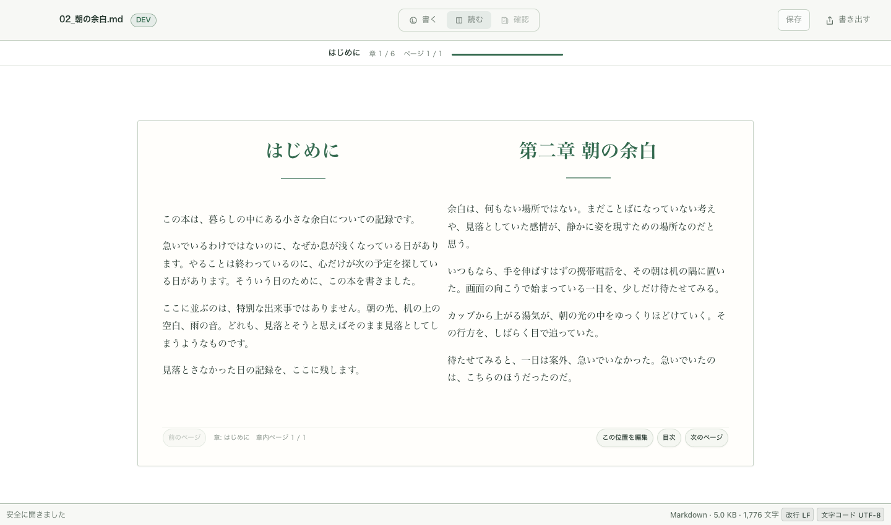
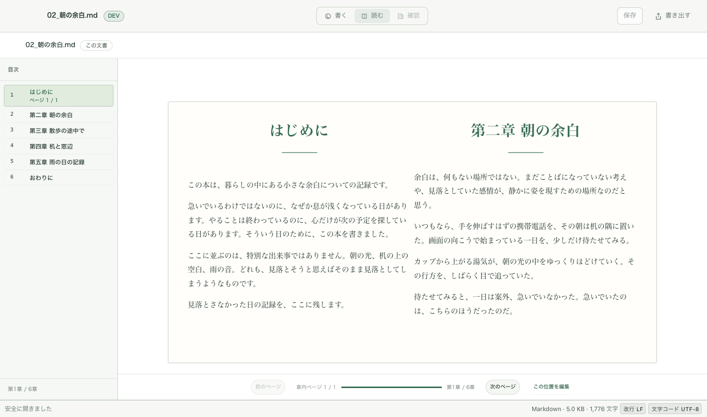
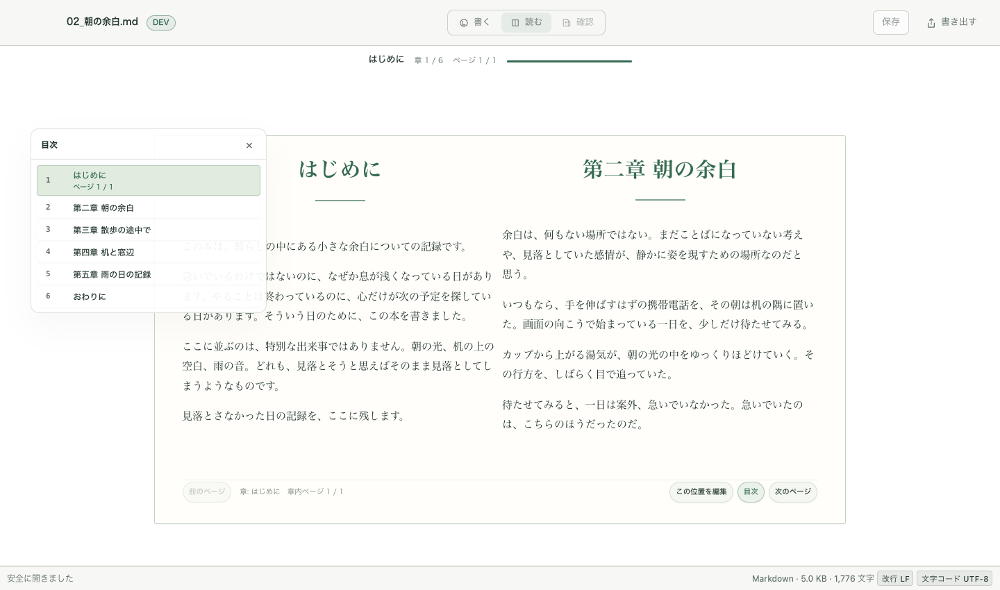
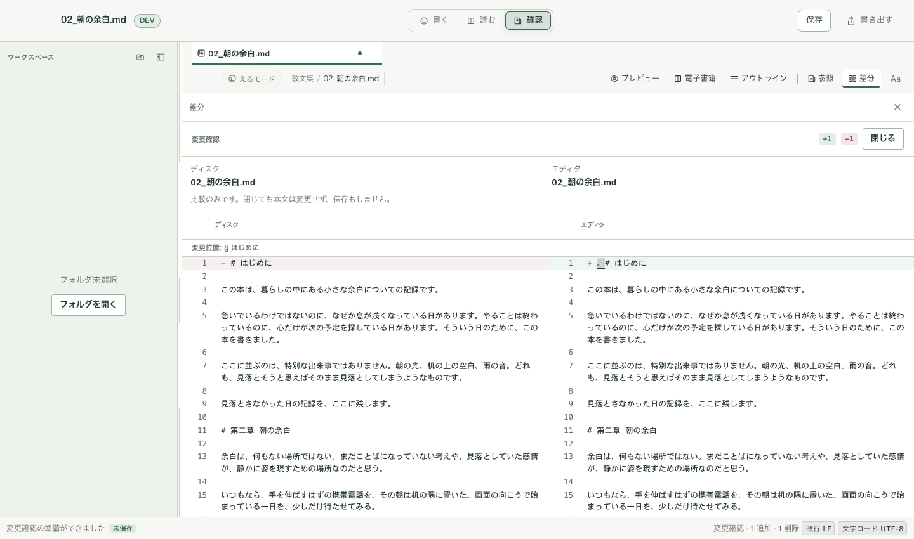
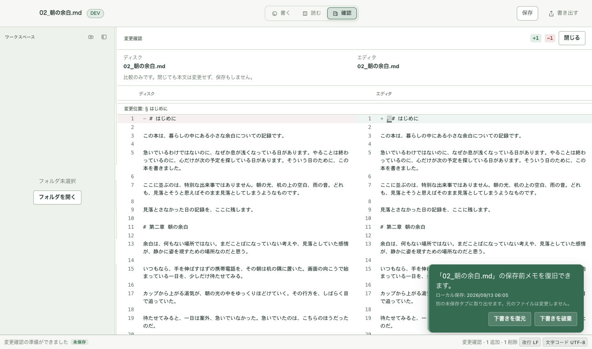

# 読書面・確認面のモック寄せ（2026-09-13）

Status: 実装済み（実機受入は未）
Scope: 「読む」の読書面（モック04）と「確認」の面（モック07/08）のレイアウト寄せ
Authority: Medium
Date: 2026-09-13

## 何をしたか

オーナー指摘（実機）:

> ・「読む」を押した後の見開き電子書籍モード…余白、ボタン配置、目次の表示、違いが大きい。
> 　ガッツリモック側に寄せてもらっていいですか？
> ・「確認」を押した後の画面も同様。説明的な部分が多いだけじゃなく、画面全体をうまく使う
> 　構成ではなく、プレビューでてるとプレビューが表示されたままだったり問題がある。
> 　グローバルなメニューなので、他の要素を表示せず、体験を重視したい。

| コミット | 内容 |
|---|---|
| `1c4cd0b4` | 読書面をモック04へ寄せる（常設目次・書名タグ・下部操作帯） |
| `34117c78` | 確認の面をフル表示に（他要素の非表示・プレビュー残留の修正） |

### 読む（読書面・モック04）

- **目次**: オーバーレイのドロワー（トグル式）を廃止し、左の**常設レール**へ。
  章リスト（章番号 + ラベル + 計測済みページ）と現在章ハイライト、下端に章位置（第x章 / y章）。
- **上部**: 「章ラベル + 章/ページ進捗」から、**書名 + 対象タグ（この文書）** へ
  （モック04の「書名 + 本全体」に対応）。章・ページ・進捗は下部へ移した。
- **下部操作帯**: 紙の中の footer から、**紙の外のメイン下端（53px）** へ。
  並びはモック04の reader-bottom に合わせ「前のページ / 章内ページ / 進捗バー / 第x章 / y章 /
  次のページ /（間隔）この位置を編集」で中央寄せ。
- **紙の内側余白**: `--ebook-sheet-pad-y` を 30〜44px へ（モック04の36px前後の基準）。
- サイドパネル（電子書籍トグル）側のUIは従来のまま（読書面＝集中時のみ変更）。

### 確認の面（モック07/08）

- **文書クローム（タブ・表示ツールバー）を確認面では出さない**（`reviewFocusActive`）。
  対象: Local Assist の提案 / 保存前の変更（差分）/ 参照 / 開いている比較。
- 確認面のときは document-column を全高の1行に（クロームが無いと面が auto 行に落ちて
  縮むため。実測 248px → 749px）。
- **提案レビューを開くとき、開いているプレビューも畳む**（`closeSidePaneForReview`）。
  従来は ebook / compare だけを畳んでいたため、プレビューが残ったまま提案面と並んでいた。
- 差分表示のとき、サイドペインのヘッダーを重ねない（**1段ヘッダー**。モック07/08と同じ）。

## 検証（実行した数字）

| 項目 | 結果 |
|---|---|
| `npm run typecheck` | ✅ |
| Vitest 全体 | ✅ **282ファイル / 2,489件** |
| `npm run build:vite` | ✅ |
| `cargo` | 未実行（Rust 無変更） |

実アプリをブラウザに描く fixture（`fixture.html` + `fixture.tsx`。ネイティブ境界のみスタブ）で実測:

- 読書面 1440×850: 目次レール **240px** / 見開きシート **996×533**（2列）/ 下部操作帯 **53px**・
  中央寄せ（前のページ右端 581 → 中央ブロック 603-967 → 次のページ 989）。
- 確認（差分）面 1440×850: 文書クローム **非表示**（null）/ 差分領域 **1154×749（全高）** /
  サイドペインヘッダー **display: none**。

## 表示

| 前 | 後 |
|---|---|
|  |  |
|  | （常設レールへ） |
|  |  |

- `before-preview-then-review.png`: プレビュー表示中に「確認」→ 保存前の変更を開いた旧状態
  （プレビューが残る問題の再現手順。提案面の残留はコード上で修正、テストで固定）。
- `before-review-menu.png`: 「確認」押下直後（対象が1つのときはメニューを経ずに直行する確認）。

## 画像との差・未決

- **ノンブル（ページ番号）と柱（running header）** は未実装。CSS Columns の各列へ
  個別に出す仕組みが無く、今回はスコープ外（フッターの章内ページで代替）。
- **非現章のページ数**は未計測のため、目次レールは読んだ章だけ「ページ x」を出す
  （モック04は全章にページ数。数字を推測で出さない既存契約を優先）。
- モック04の「見開き / 検索 / 文字設定」ボタンは**対応機能が無いため未設置**
  （機能の新設はしない。見開きは内容による自動判定のまま）。
- 右ページの次章頭出し（spare page preview）は既存仕様のまま。
- 参照面（エディタ + 参照の2分割）の構造は変えていない（文書クロームの非表示のみ適用）。

## 残リスク・未受入

- 実機（WKWebView）での読書面の操作感（ページ送り・目次ジャンプ・キーボード・狭幅）。
- 提案レビュー面の実表示（Apple Assist の提案生成が fixture で出来ないため、配線と
  構造はテストで固定。見た目の実機確認は次の受入へ）。
- 確認面の文言のうち「説明的」の具体箇所は、今回の実機フィードバックで特定できて
  いないため未変更（画面の使い方・他要素の非表示を優先した）。次の指摘を待つ。
- 読書面の「余白」のうち、周囲（紙とクロームの間）の微調整は実機の見え方で詰める。
